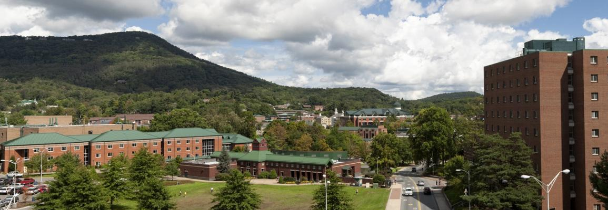

# Go 'Neers
```{r, echo=FALSE}
knitr:: 
```

Welcome to *Appalachian State University*, home of the infamous Mountaineer football (i.e. we beat Michigan University that one time in '07), mountain ranges, and free spirits. 

I am graduating in December of 2017 and ready to kickstart my career.

I've been studying Psychology with a concentration in Business. I also have minors in Statistics, Labor Relations, and Human Resource Management. 

I intend to pursue a graduate level degree in Industrial-Organizational Pyschology.