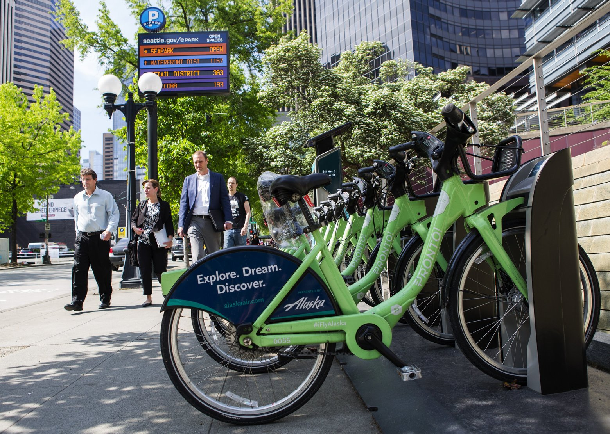

```{r setup, include=FALSE}

knitr::opts_chunk$set(echo = TRUE, fig.align = "center", comment = NA, warning = FALSE, message = FALSE, prompt = TRUE)

```


We find the orignal information for this project on Amber's website [here](https://proquestionasker.github.io/projects/2016/11/10/bicyclesseattle/).


```{r, echo = FALSE, warning = FALSE, message=FALSE}

#loading the  data

# For data manipulation and tidying
library(dplyr)
library(lubridate)
library(tidyr)

# For mapping
library(ggmap)
library(mapproj)

# For data visualizations
library(ggplot2)

# For modeling and machine learning
library(caret)
library(lubridate)

station <- read.csv(file = "station.csv", header = TRUE, 
                    stringsAsFactors = FALSE)

trip <- read.csv(file = "trip.csv", header = TRUE, 
                 stringsAsFactors = FALSE)

weather <- read.csv(file = "weather.csv", header = TRUE, 
                    stringsAsFactors = FALSE)
```

# **Introduction** 
This is a report and analysis on Seattle's bicycle sharing trends. The data includes weather reports for the area, the station locations, as well as trips taken by cycle riders. Future explorations of this type of data could include investigating more extensively the usage and effectiveness of other public transportation for this area. This would serve to establish a better understanding of public transportation trends for Seattle. *Interestingly enough*, this transportation company (Pronto Cycle Sharing) has since dissolved and the data points that were collected from this company are from October 2014-August2016. Thus, the trends showcased by this dataset are not necessarily reflective of current bike sharing trends in Seattle.


```{r, echo=FALSE}

knitr:: 

```

## Loading the Necessary Data
Data was downloaded and compiled from [Kaggle](https://www.kaggle.com/pronto/cycle-share-dataset) . csv files for "station," "trip," and "weather" from the company "Pronto Cycle Sharing" were pulled from this site and used for this project.


# Station Locations

Look how widespread the rental stations are all over Seattle (see Figure \@ref(fig:BSL))!

```{r, label = "BSL", fig.cap = "Seattle Bike Station Locations", echo = FALSE, warnings = FALSE, message=FALSE}

station %>% summarise(n_distinct(station_id))

station_locs <- station %>% group_by(station_id) %>% select(1:4, -2)

mymap <- get_map(location = c(lat = 47.60, lon = -122.35), maptype = "roadmap", zoom = 12)

# Plot a single point for each Station ID
ggmap(mymap) + geom_point(aes(x = long, y = lat), data = station_locs, 
                          alpha = 1, color = "darkred", size = 2)

```

## Locations (zoomed)

For optimal viewing, here are the station whereabouts with some zoom for location precision.

```{r, label = "closeUp",  fig.cap = "Closeup", warning=FALSE, message=FALSE, echo = FALSE}

closeUp <- get_map(location = "Seattle", maptype = "roadmap", zoom = 13)

# Plot a single point for each Station ID
ggmap(closeUp) + geom_point(aes(x = long, y = lat), data = station_locs, 
                            alpha = 1, color = "darkred", size = 3)

```


Look at all those stations! Its hard to believe this company managed to go out of business!


## Current Dock Count

```{r, label = "nbs",  fig.cap = "Station Bike Counts", echo = FALSE, message=FALSE, warning = FALSE}

#histogram showing current dock count
ggplot(data = station, aes (x = current_dockcount)) +
  geom_bar(fill = "lightcoral", color = "black") +
  theme_classic() +
  labs( x = "Number of bikes per station", y= "Count", title = "Current Dock Count")

```

Quite a few bikes to choose from (as of August 2016)!


## Change in Number of Bike Docks Per Station

```{r, label = "bikesPerStation", fig.cap= "Bikes Per Station", warning = FALSE, message=FALSE, echo = FALSE}

dock_change <- station %>% group_by(station_id) %>% select(station_id, 
                                                           long, lat, ends_with("dockcount")) %>% mutate(dock_change = current_dockcount - 
                                                                                                           install_dockcount)


closeUp <- get_map(location = "Seattle", maptype = "roadmap", zoom = 13)

ggmap(closeUp) + geom_point(aes(x = long, y = lat, size = factor(dock_change), 
                                color = factor(dock_change)), 
                            data = dock_change, alpha = 0.8) + 
  guides(color = guide_legend(title = "change"), size = guide_legend(title = "change")) + 
  scale_size_manual(values = 10:1)


# Change in docking station 
dock_change <- station %>% group_by(station_id) %>% select(station_id, 
                                                           long, lat, ends_with("dockcount")) %>% mutate(dock_change = current_dockcount -     install_dockcount)


```


11 stations lost bike docks, 39 docks stayed the same, 8 stations gained docks.


# Number of Rides Per Day

```{r, label = "visualRidesPerDay", fig.cap = "Daily Riders", message=FALSE, echo = FALSE, warning = FALSE}

# Make the start and stop dates into POSIXct objects
trip_2 <- trip %>% mutate(start_dt = mdy_hm(starttime), stop_dt = mdy_hm(stoptime))

trip_2 <- trip_2 %>% mutate(start_date = paste(month(start_dt), 
                                               day(start_dt), year(start_dt), sep = "/"))
trip_2$start_date <- mdy(trip_2$start_date)

trip_2 <- trip_2 %>% mutate(stop_date = paste(month(stop_dt), 
                                              day(stop_dt), year(stop_dt), sep = "/"))
trip_2$stop_date <- mdy(trip_2$stop_date)


# Recode the dates
trip_2 %>% 
  
  group_by(start_date) %>%
  
  summarize(N = n()) %>%
  
  ggplot(aes(x = start_date, y = N)) + 
  
  geom_line() + 
  
  labs(x = "Date", y = "Number of trips per day") + 
  
  theme_bw() + geom_smooth()


```

People really like going on fall and spring rides multiple times a day. Can you blame them though, Seattle in the fall is remarkable (see below)!!!


```{r, label = "fall", echo=FALSE}

knitr:: include_graphics("fall.jpg")

```


# Plotting trips per month (by season; excluding summer)

```{r, results = 'asis', label = "monthSeason", fig.cap = "Trips by season, per month", echo = FALSE, message=FALSE, warning = FALSE, cache=FALSE}

start_date_ym <- trip_2 %>% 
  mutate(ym = paste(year(start_date), 
                    month(start_date), sep = "/"), Season = ifelse(ym %in% c("2014/10", "2014/11"), "Fall",
                                                                   ifelse(ym %in% c("2014/12", "2015/1", "2015/2"), "Winter",
                                                                          ifelse(ym %in% c("2015/3", "2015/4", "2015/5"), "Spring", "Summer"))))


# ggplot(start_date_ym, aes(x = start_date, y = N))
start_date_ym %>%
  group_by(ym, Season) %>%
  summarize(N=n()) %>%
  ggplot(aes(x = ym, y = N, color = Season, fill = Season, group = Season)) + 
  geom_point() +
  geom_line(group = 1) + 
  theme_bw() +
  labs(x = "Date", y = "Number of Trips(per month)")

```
December, January, and February are coded as "Winter," March, April, and May are coded as "Spring," and September, October, and November are coded as "Fall." 
It is pretty obvious that usage would peak in the mid-fall, decline going into the winter months, and start a gradual increase as it transitions from winter into spring. Spring is the ultimate peak of bike riding peaking about early to mid-March.


# Average Trip Duration

```{r, label = "minutesSeason", fig.cap= "Conversions", message=FALSE, echo = FALSE, warning = FALSE}

Trip_Duration_Month <- start_date_ym %>% 
  mutate(trip_duration_min = tripduration/60) %>% 
  group_by(ym) %>% 
  select(ym, trip_duration_min, Season) %>% 
  summarise(Avg = mean(trip_duration_min), 
            sd = sd(trip_duration_min)) %>% 
  mutate(se = sd/sqrt(n()), Season = ifelse(ym %in% c("2014/10", "2014/11"), "Fall",
                                                                   ifelse(ym %in% c("2014/12", "2015/1", "2015/2"), "Winter",
                                                                          ifelse(ym %in% c("2015/3", "2015/4", "2015/5"), "Spring", "Summer"))))

Trip_Duration_Month %>%
  ggplot(aes(x = ym, y = Avg, col = Season, fill = Season, group = Season)) + 
  geom_point()+
  geom_line(aes(group = 1)) + 
  labs(x = "Date" , y = "Duration of Average Trip (minutes)") + 
  theme_bw() + 
  geom_errorbar(aes(ymin = Avg - se, ymax = Avg + se))
  
```
Not a huge amount of variance between the seasons and the amount of time spent on the average ride. This could also be due to the sheer expense of riding with Pronto in general for both members and nonmembers.


# Number of Trips by Day of Week

```{r, fig.cap = "Weekday Trips", echo = FALSE, warning=FALSE, message=FALSE}

 trip_2$wd <- wday(trip_2$start_date, label = TRUE)
 tripduration_m <- (trip_2$tripduration)/60
 trip22<-trip_2
 trip22<-cbind(trip22, tripduration_m)
 ym <- format(trip22$start_date, "%Y/%m")
 trip22<- cbind(trip22,ym)
 
 trip22 <-mutate(trip22, Season = ifelse(ym %in% c("2014/10", "2014/11"), "Fall",
                                      ifelse(ym %in% c("2014/12", "2015/1", "2015/2"), "Winter",
                                      ifelse(ym %in% c("2015/3", "2015/4", "2015/5"), "Spring", "Summer"))))%>%
   group_by(Season)
 

trip22 %>%
  group_by(wd, Season) %>%
  summarize(N = n())%>%
  ggplot(aes(x = wd, y = N, col = Season, fill = Season, group = Season)) + 
  geom_point() + 
  geom_line() + 
  theme_bw() + 
  labs(x = "Day of the Week", y= "Number of Trips", title = "Trips Per Day")


```
Oddly enough, there is no day of the week that is consistently higher (even on the weekends). Obviously the summer has the highest level of riders, but otherwise, no a lot of distint trends from this plot.


# Number of Trips Per Time of Day

```{r, fig.cap = "Daily Trip Log", message = FALSE, warnings = FALSE, echo = FALSE}

trip22 %>%
  group_by(Hour = hour(start_dt), Season, wd) %>%
  summarize(N = n()) %>%
 ggplot(aes(x = Hour, y= N, color = Season, group = Season)) +
  geom_point() +
  geom_line() + 
  facet_wrap(~wd) + 
  theme_bw() +
  labs(x = "Hour of Day", y = "Number of Trips")

```

People seem to most commonly use this service during the peak commuting hours (i.e. 8am and 5pm). However, on the weekends, the peak is around mid-day.


# Number of Trips by Member Type

```{r, fig.cap = "Trips of Members v. Short-Term Pass Holder", message = FALSE, warnings = FALSE, echo = FALSE}

trip22 %>%
  filter(usertype !="") %>%
  group_by(Season, usertype, ym) %>%
  summarize(N = n()) %>%
  ggplot(aes(x = ym, y = N, color = Season, group = usertype, fill = usertype)) + 
  geom_point(aes(shape = usertype), size = 3) + 
  geom_line() + 
  theme_bw() + 
  labs(x = "Date", y= "Total Number of Trips Per Month")

```
As to be expected, members have much overall higher usage rates than short-term pass holders (24 hour pass or a 3 day pass are the two options for short-term). Short-term passes are likely most appropriate for tourists or people who are vacationing in Seattle. 

The two plots almost mimic one another as far as usuage rates go - this is interesting because of the differentials between members and short-term passholders.


# Trip Duration by Member Type

```{r, label = "tripdur", fig.cap = "Members v. Short-Term Pass Holder", message = FALSE, warnings = FALSE, echo = FALSE}

#Frequency histogram
library(tidyverse)
start_date_ym <- mutate(start_date_ym, freelim= ifelse(usertype=="Member", 45, 30))
start_date_ym %>%
  filter(usertype !="") %>%
  group_by(tripduration, trip_id, usertype, freelim) %>%
  summarize(N=n()) %>%
  ggplot(aes(x=tripduration/60, fill=usertype), group=usertype) +
    geom_histogram(binwidth = 2, show.legend = FALSE) +
    xlim(1,60) +
    facet_grid(.~usertype) + 
    scale_fill_manual(values=c("seagreen1", "navy")) +
    theme_bw() +
    guides(colour=FALSE) +
    geom_vline(aes(xintercept=freelim), linetype="dashed") +
    labs(x="Trip Duration (minutes)", y="Number of Trips") 

```

There are three different membership options: short term membership where you can pay $8 for 24 hours or $16 for 3 days, and long-term membership which requires payment of $85 for an annual membership. 

At least 30 minutes is allocated for each ride for members; and depending on your membership status, different levels of fees are incurred for each additional 30 minutes. For short-term members, any additional time exceeding 30 minutes incurs a $2 fee for the first extra 30 minutes, and $5 for each 30 minutes following.Long-term members are actually allowed 45 minute bike rides and for each 30 minutes after that it is a $2 fee. 
(see Figure \@ref(fig:tripdur))!

Interesting that ride times peak around 10 minutes regardless of the type of member. And after 20 minutes, long-term members rides drop off drastically as compared to the gradual decrease in short-term member's ride times. Perhaps long term members are using the bikes for a primary source of transportation to and from work - hence the significantly shorter ride times.


##Cost of a Biking Trip 

```{r, label = "CBT", fig.cap = "Trip Cost for Members v. Non-Members", echo = FALSE, message = FALSE, warnings = FALSE}

start_date_ym <- mutate(start_date_ym, tripduration_m = tripduration/60)
start_date_ym <- start_date_ym %>% mutate(cost = ifelse(usertype == "Member" & tripduration_m <= 45,0, ifelse(usertype == "Member" & tripduration_m > 45 & tripduration_m <= 75, 2, ifelse(usertype == "Member" & tripduration_m > 75, (2 + 2*ceiling((tripduration_m -75)/30)), ifelse(usertype == "Short-Term Pass Holder" & tripduration_m <= 30, 0, ifelse(usertype == "Short-Term Pass Holder" & tripduration_m > 30 & tripduration_m < 60, 2, ifelse(usertype == "Short-Term Pass Holder" & tripduration_m > 60, (2 + 5 * ceiling((tripduration_m - 60)/30)), NA)))))))
  
  
start_date_ym %>%
  filter(cost > 0) %>%
ggplot(aes(x = cost, fill = usertype)) +
  geom_histogram() +
  facet_grid(.~ usertype) +
  scale_fill_manual(values = c("steelblue1", "gold")) +
  guides(fill = F) +
  theme_bw() +
  theme(axis.text.x = element_text(angle = 60, hjust = 1)) +
  labs(x = "Additional Fee($)")

```
It is definitely worth it to be a member vs. a nonmember, there are many associated costs if you aren't (see Figure \@ref(fig:CBT))!


# Bicycle Sharing Member Demographics

```{r, fig.cap = "Member Ages", message = FALSE, warnings = FALSE, echo = FALSE}

trip_2$usertype <- as.factor(trip_2$usertype)
trip_age <- trip_2 %>% mutate(age = year(start_dt) - birthyear)

hist(trip_age$age, main = "Member Age", xlab = "Number of Riders", col = "plum1", breaks = 25)

```
Riders tend to be aged towards the upper 20s, but this number could be misleading because we don't have any real identifiers for the users (i.e. is one 20 year old taking 100 trips a day, or if there are a ton of 20 year olds using the service one time).


#Temperature Variance In Seattle

## Minimum Temperatures

```{r, fig.cap = "Min. Temps", message = FALSE, warnings = FALSE, echo = FALSE}

# Adjusting the Date Variable
weather$Date <- mdy(weather$Date)

# Adjusting the Events Variable
weather$Events <- as.factor(weather$Events)


weather$Events <- gsub("Fog , Rain|Fog-Rain", "Fog-Rain", weather$Events)
weather$Events <- gsub("Rain , Snow|Rain-Snow", "Rain-Snow", 
    weather$Events)
weather$Events <- gsub("Rain , Thunderstorm|Rain-Thunderstorm", 
    "Rain-TS", weather$Events)

weather$Events <- as.factor(weather$Events)

weather$Max_Gust_Speed_MPH <- gsub("-", 0, weather$Max_Gust_Speed_MPH)

weather$Max_Gust_Speed_MPH <- as.numeric(weather$Max_Gust_Speed_MPH)

weather[which(is.na(weather$Mean_Temperature_F)), 1]
weather[490, "Mean_Temperature_F"] <- 50

weather$Events <- gsub("^$", "Other", weather$Events)
weather$Events <- as.factor(weather$Events)


weather %>% 
  
  group_by(Date) %>%
  
  ggplot(aes(x = Date, y = Min_TemperatureF)) + 
  
  geom_line() + 
  
  labs(x = "Date", y = "Minimum Temperature (F)") + 
  
  theme_bw() 


```
Must not be acccounting for wind-chill. I feel like it gets colder than the low 20's in Seattle!


##Mean Temperatures

```{r, fig.cap = "Mean. Temps", message = FALSE, warnings = FALSE, echo = FALSE}

weather %>% 
  
  group_by(Date) %>%
  
  ggplot(aes(x = Date, y = as.numeric(Mean_Temperature_F))) + 
  
  geom_line() + 
  
  labs(x = "Date", y = "Mean Temperature (F)") + 
  
  theme_bw() 

```
Looks like they have all 4 seasons, instead of just the "perpetual rain" we always associate with Seattle.

##Maximum Temperatures


```{r, fig.cap = "Max Temps", message = FALSE, warnings = FALSE, echo = FALSE}

weather %>% 
  
  group_by(Date) %>%
  
  
  ggplot(aes(x = Date, y = Max_Temperature_F)) + 
  
  geom_line() + 
  
  labs(x = "Date", y = "Maximum Temperature (F)") + 
  
  theme_bw() 

```
It definitely gets hotter than I anticipated there. With temperatures close to 100 degrees, it sounds like we're talking about a southern city vs. one in the north-west hemisphere.


# Local Weather Events

```{r, fig.cap = "Frequency of Type of Weather", message = FALSE, warnings = FALSE, echo = FALSE}

weather %>%
  ggplot(aes(x = as.factor(Events)))+
  geom_bar(fill = "turquoise1")+
  labs(x = "Events", y = "Number of Events") +
  theme_bw()

```
What a rainy city - I guess the rumors are true since it is the most frequent weather event following "other"!!

# Mean Temperature vs. Number of Trips

```{r, fig.cap = "Temperature and it's Relationship with Trip Number", message = FALSE, warnings = FALSE, echo = FALSE}

# Make a copy of the data frame
trip_3 <- trip22

# Change column name in trip_3 to match weather dataset
trip_3$Date <- trip_3$start_date

# Left join the trip and weather dataframes by date.
trip_weather <- left_join(trip_3, weather, by = "Date")


trip_weather %>%
  mutate(Mean_Temperature_F5 = 5*round(Mean_Temperature_F/5))%>%
  group_by(Mean_Temperature_F5) %>%
  summarize(N = n()) %>%
  ggplot(aes(x = Mean_Temperature_F5, y = N)) +
    geom_line() + 
    theme_bw() + 
    labs(x = "Temperature (Rounded to Nearest 5 degrees F)", y = "Number of Trips")

```
People like to ride when it's not too hot, but also when it is not too cold. Additionally, for the purposes of this graph, the temperatures are rounded to the nearest 5 degrees Fahrenheit


## Normalize the Temperature vs. Number of Trips
```{r, fig.cap = "Temperature and it's Relationship with Trip Number 2", message = FALSE, warnings = FALSE, echo = FALSE}

trip_weather %>%
  mutate(Mean_Temperature_F5 = 5*round(Mean_Temperature_F/5))%>%
  group_by(Mean_Temperature_F5) %>%
  summarize(N = n(), Days = n_distinct(Date)) %>%
  mutate(Ratio = N/Days)%>%
  ggplot(aes(x = Mean_Temperature_F5, y = Ratio)) +
    geom_line() + 
    theme_bw() + 
    labs(x = "Temperature (Rounded to Nearest 5 degrees F)", y = "Number of Trips / Number of Days at Temperature")


```
This chart shows a positive, linear relationship (standardized from the data from the previous chart) that shows the correlation between temperature and number of rides. Further reinforcing the fact that people are much more likely to ride when it is warm outside. 

# Precipitation vs. Number of Trips

```{r, fig.cap = "Rain Events and it's Relationship with Trip Number", message = FALSE, warnings = FALSE, echo = FALSE}

trip_weather %>%
  mutate(Precipitation_In.2 = .2*round(Precipitation_In/.2))%>%
  group_by(Precipitation_In.2) %>%
  summarize(N = n(), Days = n_distinct(Date)) %>%
  mutate(Ratio = N/Days)%>%
  ggplot(aes(x = Precipitation_In.2, y = Ratio)) +
  geom_line() +
  theme_bw() +
  labs(x = "Precipitation (Rounded to the Nearest 0.2 Inches)", y = "Number of Trips / Number of Days at Precipitation Level")

```

This chart kind of speaks for itself as well, however, the more it rains, the less likely that people are willing to use the bicycle sharing system. However, rain does not seem to always impair people's want/need to ride a bike, but it does have a rather dramatic impact.


#**Conclusion**
Annnnnnnd that's a wrap. Data from the doomed bike sharing system and a graphical analysis of it. Hope you enjoyed my recreation of this project intially done by Amber Thomas and my examination of it.
```{r, echo=FALSE}

knitr:: 

```